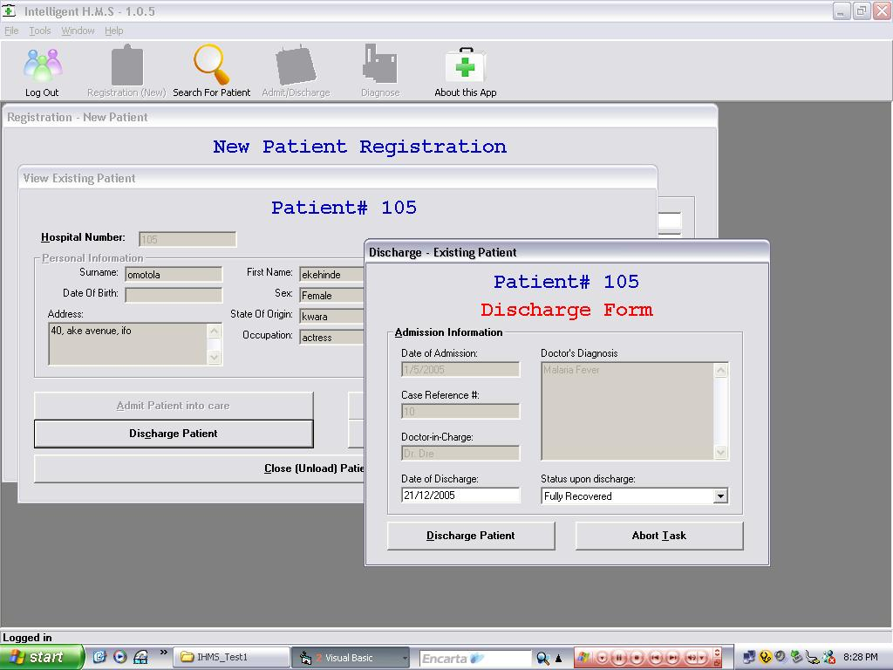



## Intelligent Hospital Management System

### Description

This is the final (FINISHED) version of my Intelligent Hospital Management Project, which is an application that manages hospital records for patients and assists the doctor in diagnosing patient diseases based on symptoms supplied as input to the program. New patients can be REGISTERED, existing patients can be ADMITTED or DISCHARGED, based on their current status, a hospital history of each patient is maintained, showing the kinds of illnesses they've been admitted for in the hospital.

Your comments are very welcome. (and votes, Please )
 
### More Info
 

             |
---                |---
**Submitted On**   |2006-04-18 09:11:42
**By**             |['seyi Ogunbanjo](https://github.com/Planet-Source-Code/PSCIndex/blob/master/ByAuthor/seyi-ogunbanjo.md)
**Level**          |Advanced
**User Rating**    |4.6 (32 globes from 7 users)
**Compatibility**  |VB 6\.0
**Category**       |[Complete Applications](https://github.com/Planet-Source-Code/PSCIndex/blob/master/ByCategory/complete-applications__1-27.md)
**World**          |[Visual Basic](https://github.com/Planet-Source-Code/PSCIndex/blob/master/ByWorld/visual-basic.md)
**Archive File**   |[IHMS\_Final1988064182006\.zip](https://github.com/Planet-Source-Code/seyi-ogunbanjo-intelligent-hospital-management-system__1-64393/archive/master.zip)

